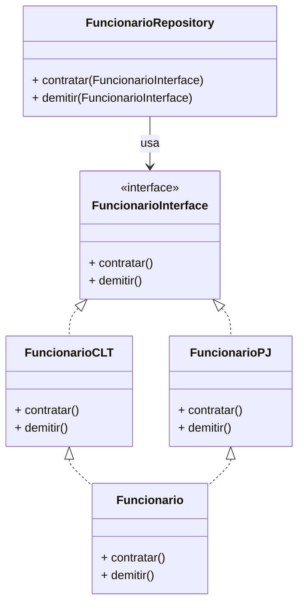

```mermaid
classDiagram
    FuncionarioInterface <|.. FuncionarioCLT
    FuncionarioInterface <|.. FuncionarioPJ
    FuncionarioCLT <|.. Funcionario
    FuncionarioPJ <|.. Funcionario

    FuncionarioRepository --> FuncionarioInterface : usa

    class FuncionarioInterface {
        <<interface>>
        + contratar()
        + demitir()
    }

    class FuncionarioCLT {
        + contratar()
        + demitir()
    }

    class FuncionarioPJ {
        + contratar()
        + demitir()
    }
    class Funcionario {
        + contratar()
        + demitir()
    }

    class FuncionarioRepository {
        + contratar(FuncionarioInterface)
        + demitir(FuncionarioInterface)
    }

```